# MailGuard Workflow - Detailed Mermaid Diagram

## 1. Complete Email Analysis Workflow

```mermaid
graph TD
    A["👤 User Opens Email<br/>in Gmail/Outlook/Yahoo"] -->|DOM Event| B["📄 Content Script Detects<br/>Email Element"]
    
    B -->|MutationObserver| C["🔍 Extract Email Metadata<br/>- From Address<br/>- Display Name<br/>- Subject Line<br/>- All Links/URLs<br/>- Attachment Count"]
    
    C -->|Message Event| D["⚙️ Background Service Worker<br/>Receives Analysis Request"]
    
    D -->|Check Storage| E{Is Sender<br/>Whitelisted?}
    
    E -->|YES| F["✅ PASS<br/>Skip Analysis<br/>No Banner"]
    E -->|NO| G["🔬 Run Local Heuristics"]
    
    G -->|Check 1| H1["1️⃣ Display Name Mismatch<br/>Compare name vs domain<br/>+25 points if suspicious"]
    G -->|Check 2| H2["2️⃣ URL Analysis<br/>Check for @ symbol<br/>IP addresses<br/>URL encoding<br/>Long paths >100 chars<br/>+15 per issue"]
    G -->|Check 3| H3["3️⃣ Urgency Keywords<br/>verify account<br/>confirm password<br/>account suspended<br/>unauthorized activity<br/>+10 points if found"]
    
    H1 --> I["📊 Calculate Risk Score<br/>Sum all points<br/>Cap at 100"]
    H2 --> I
    H3 --> I
    
    I --> J{Risk Score<br/>Assessment}
    
    J -->|0-34| K["✅ Legitimate<br/>Score: GREEN"]
    J -->|35-65| L["⚠️ Suspicious<br/>Score: YELLOW"]
    J -->|66-100| M["🚨 Phishing Alert<br/>Score: RED"]
    
    K --> N["🎯 Result Summary<br/>Suspicious: false<br/>Source: local"]
    L --> N
    M --> N
    
    N -->|Score ≥ 35| O["🎨 Generate Warning Banner<br/>- Risk Score Display<br/>- List of Reasons<br/>- Dismiss Button<br/>- Report Button"]
    N -->|Score < 35| P["⏭️ No Banner<br/>Continue Normally"]
    
    O --> Q["💉 Inject Banner into Email DOM<br/>Styled for Gmail/Outlook"]
    P --> R["📧 User Reads Email<br/>Normally"]
    
    Q --> S["👁️ User Sees Warning<br/>with Risk Score & Reasons"]
    
    S -->|Dismiss| T["👆 User Dismisses<br/>Banner Hidden<br/>Data Cleared"]
    S -->|Report| U{Privacy Consent<br/>Given?}
    
    U -->|NO| V["🔒 Show Consent Dialog<br/>Explain data sharing<br/>Ask for permission"]
    U -->|YES| W["📤 Send Report to Backend<br/>Data: from, subject,<br/>risk factors"]
    
    V -->|Accept| W
    V -->|Decline| T
    
    W --> X["☁️ Backend Analysis<br/>POST /api/report<br/>Store for ML training"]
    X --> Y["✨ User Notification<br/>Thank you for reporting"]
    Y --> T
```

---

## 2. System Architecture & Data Flow

```mermaid
graph LR
    subgraph Browser["🌐 User's Browser"]
        CS["📄 Content Script<br/>Gmail/Outlook Adapter"]
        banner["🎨 React Banner<br/>Component"]
        storage["💾 Extension Storage<br/>Preferences & Whitelist"]
        SW["⚙️ Background<br/>Service Worker"]
    end
    
    subgraph Heuristics["🔬 Local Analysis<br/>No Data Sent"]
        URL["URL Checker<br/>@ symbol, IP, encoding"]
        DN["Display Name<br/>Checker"]
        KW["Keyword<br/>Detector"]
        SCORE["Score<br/>Calculator"]
    end
    
    subgraph Cloud["☁️ Backend API<br/>Optional - Opt-in Required"]
        ANALYZE["POST /api/analyze<br/>Advanced ML models"]
        REPORT["POST /api/report<br/>Store reports"]
        STATS["GET /api/stats<br/>Analytics"]
    end
    
    CS -->|Email Data| SW
    SW -->|Analyze| URL
    SW -->|Analyze| DN
    SW -->|Analyze| KW
    URL --> SCORE
    DN --> SCORE
    KW --> SCORE
    
    SCORE -->|Score ≥ 35| banner
    banner -->|Inject| CS
    
    SW -->|Load Preferences| storage
    SW -->|Check Whitelist| storage
    
    SW -->|If Opt-in| ANALYZE
    SW -->|If Report & Consent| REPORT
    
    CS -->|User Click Report| SW
    REPORT --> STATS
```

---

## 3. Heuristics Scoring System - Detailed

```mermaid
graph TD
    EMAIL["📧 Email Arrives"]
    
    EMAIL -->|Extract| SENDER["From: phisher@evil.com<br/>Name: Amazon Support<br/>Subject: Verify Now!<br/>Links: 3 URLs"]
    
    SENDER --> H1TITLE["🔍 Heuristic 1: Display Name Mismatch"]
    SENDER --> H2TITLE["🔍 Heuristic 2: URL Analysis"]
    SENDER --> H3TITLE["🔍 Heuristic 3: Keyword Detection"]
    
    H1TITLE --> H1["Compare: 'Amazon Support' vs<br/>domain 'evil.com'<br/>Mismatch detected?<br/>YES ✓"]
    H1 -->|Match?| H1A["❌ Mismatch Found<br/>+25 POINTS"]
    H1A --> H1RESULT["Display Name Risk: 25"]
    
    H2TITLE --> H2["Check URLs:<br/>Link 1: https://192.168.1.1/verify<br/>Link 2: https://amazon.com@evil.com<br/>Link 3: https://bit.ly/abc123"]
    H2 -->|Feature 1| H2A["IP Address in URL?<br/>192.168.1.1 ✓<br/>+15 POINTS"]
    H2 -->|Feature 2| H2B["@ Symbol in URL?<br/>amazon.com@ present ✓<br/>+15 POINTS"]
    H2 -->|Feature 3| H2C["URL Encoding Issues?<br/>No ✗<br/>+0 POINTS"]
    H2 -->|Feature 4| H2D["Path Too Long >100?<br/>No ✗<br/>+0 POINTS"]
    H2A --> H2RESULT["URL Risk: 30"]
    H2B --> H2RESULT
    H2C --> H2RESULT
    H2D --> H2RESULT
    
    H3TITLE --> H3["Search Keywords:<br/>Subject: 'Verify Now!'<br/>Body contains 'Account Suspended'"]
    H3 -->|Check| H3A["Urgency Trigger?<br/>verify, confirm ✓<br/>+10 POINTS"]
    H3 -->|Check| H3B["Password Request?<br/>No ✗<br/>+0 POINTS"]
    H3 -->|Check| H3C["Account Threat?<br/>suspended ✓<br/>+10 POINTS"]
    H3A --> H3RESULT["Keyword Risk: 20"]
    H3B --> H3RESULT
    H3C --> H3RESULT
    
    H1RESULT --> CALC["📊 SCORE CALCULATION<br/>25 + 30 + 20 = 75"]
    H2RESULT --> CALC
    H3RESULT --> CALC
    
    CALC --> CLASSIFY{Classification}
    
    CLASSIFY -->|0-34| LEGIT["✅ LEGITIMATE<br/>Green Score"]
    CLASSIFY -->|35-65| WARN["⚠️ SUSPICIOUS<br/>Yellow Score"]
    CLASSIFY -->|66-100| ALERT["🚨 PHISHING<br/>Red Score"]
    
    ALERT --> RESULT["FINAL DECISION<br/>Score: 75/100<br/>Action: SHOW BANNER<br/>Severity: HIGH"]
```

---

## 4. Message Flow Sequence

---

## 5. Privacy & Opt-in Flow

```mermaid
graph TD
    A["📧 Email Arrives"] -->|LOCAL ANALYSIS| B["🔬 Run Heuristics<br/>✅ OFFLINE<br/>NO DATA SENT"]
    
    B -->|Score ≥ 35?| C["⚠️ Show Banner"]
    
    C -->|User Clicks Report| D{Check Privacy<br/>Consent Setting}
    
    D -->|❌ NO CONSENT| E["🔒 Show Consent Dialog<br/>Explain:<br/>- Data being sent: from, subject<br/>- Data NOT sent: body, attachments<br/>- Used for: ML training<br/>- User can opt-out anytime"]
    
    E -->|User Accepts| F["✅ Privacy Consent = TRUE<br/>Store in chrome.storage.sync"]
    E -->|User Declines| G["❌ Privacy Consent = FALSE<br/>Report NOT sent<br/>Banner dismissed"]
    
    D -->|✅ YES CONSENT| H["✅ Send Report to Backend"]
    F --> H
    
    H -->|POST /api/report| I["☁️ Backend Stores Report<br/>- from: email address<br/>- subject: email subject<br/>- reasons: detected phishing factors<br/>- timestamp: when reported"]
    
    I --> J["📊 Backend Uses Data For:<br/>- Analytics & statistics<br/>- ML model retraining<br/>- Threat intelligence"]
    
    J --> K["⚙️ User Can Always:<br/>- Toggle Cloud Analysis on/off<br/>- View/Clear Report Count<br/>- Manage Whitelist<br/>- Clear All Data"]
```

---

## 6. Local vs Cloud Analysis Decision Tree

```mermaid
graph TD
    A["📧 Email Arrives"] -->|Always| B["✅ Local Analysis<br/>Heuristics"]
    
    B -->|Suspicious| C["⚠️ Show Banner"]
    B -->|Legitimate| D["✅ No Banner"]
    
    C -->|User Reports| E{Check Setting:<br/>cloudAnalysisEnabled?}
    
    E -->|FALSE<br/>Default| F["☁️ Skip Cloud Analysis<br/>Only send to backend if<br/>user clicks 'Report'"]
    E -->|TRUE<br/>Opted-in| G["☁️ Send to Backend<br/>for Advanced Analysis"]
    
    F -->|User Reports| H{Check:<br/>privacyConsent?}
    G -->|Always| H
    
    H -->|FALSE| I["🔒 Request Consent<br/>First"]
    H -->|TRUE| J["📤 Send to Backend<br/>POST /api/analyze or<br/>POST /api/report"]
    
    I -->|User Approves| J
    I -->|User Declines| K["❌ Don't Send<br/>Stop Here"]
    
    J --> L["ML Analysis<br/>- DistilBERT on text<br/>- XGBoost on URLs<br/>- Pattern matching"]
    
    L --> M["📊 Enhanced Result<br/>Combine local + cloud scores"]
    M --> C
```

---

## 7. Complete Extension Lifecycle

```mermaid
graph LR
    A["🚀 User Installs<br/>Extension"] --> B["📝 Manifest V3<br/>Loaded"]
    
    B --> C["⚙️ Background<br/>Service Worker<br/>Activated"]
    
    C --> D["💾 Initialize Storage<br/>cloudAnalysisEnabled: false<br/>privacyConsent: false<br/>whitelistedSenders: []"]
    
    D --> E["🌐 Listen to<br/>Content Scripts"]
    
    E --> F["📄 Content Scripts<br/>Inject into Gmail/<br/>Outlook Pages"]
    
    F --> G["👁️ Monitor DOM<br/>for Email Opens"]
    
    G --> H["🔍 Extract Email<br/>Metadata"]
    
    H --> I["📤 Send to<br/>Background Worker"]
    
    I --> J["🔬 Run Local<br/>Analysis"]
    
    J --> K["🎨 Inject Banner<br/>if Suspicious"]
    
    K --> L["👤 User Interacts<br/>Dismiss/Report"]
    
    L -->|Loop| G
    
    M["⚙️ User Opens<br/>Options Page"] --> N["🎛️ Settings UI<br/>Toggle Cloud Analysis<br/>Manage Whitelist<br/>Clear Data"]
    
    N -->|Updates| D
    
    O["🗑️ User<br/>Uninstalls"] --> P["🧹 All Data<br/>Cleared"]
```

---

## 8. Testing & QA Workflow

```mermaid
graph TD
    A["📝 Code Changes"] --> B["🧪 Unit Tests<br/>27 Test Cases"]
    
    B --> B1["URL Heuristics: 8 tests"]
    B --> B2["Display Name: 6 tests"]
    B --> B3["Keywords: 9 tests"]
    B --> B4["Integration: 4 tests"]
    
    B1 --> C{All Passing?}
    B2 --> C
    B3 --> C
    B4 --> C
    
    C -->|❌ FAIL| D["🐛 Debug & Fix"]
    D --> A
    
    C -->|✅ PASS| E["🎭 E2E Tests<br/>13 Scenarios"]
    
    E --> E1["Phishing Detection: 7"]
    E --> E2["Email Classification: 3"]
    E --> E3["UI Interaction: 2"]
    E --> E4["Privacy: 1"]
    
    E1 --> F{All Passing?}
    E2 --> F
    E3 --> F
    E4 --> F
    
    F -->|❌ FAIL| D
    
    F -->|✅ PASS| G["🔒 Security Review"]
    
    G --> H["📊 Coverage Report"]
    
    H --> I{Coverage<br/>Acceptable?}
    
    I -->|❌ < 80%| D
    I -->|✅ ≥ 80%| J["🚀 Ready for Merge"]
```

---

## 9. Deployment Pipeline

```mermaid
graph LR
    A["📦 Build Artifacts"] 
    
    A -->|npm run ext:build| B["🎁 Extension Package<br/>extension/dist/<br/>extension.zip"]
    A -->|npm run backend:build| C["🐳 Backend Build<br/>backend/dist/"]
    
    B --> D["🏪 Chrome Web Store<br/>Upload extension.zip<br/>Fill Metadata<br/>Google Review 3-5d"]
    B --> E["🦊 Firefox Add-ons<br/>Sign with web-ext<br/>Mozilla Review 1-3d"]
    B --> F["📄 GitHub Release<br/>Attach extension.zip"]
    
    D --> G["✅ Published<br/>2M+ Users"]
    E --> H["✅ Published<br/>1M+ Users"]
    
    C --> I["🐳 Docker Build<br/>docker build -t<br/>mailguard:latest"]
    
    I --> J["🔐 Push to Registry<br/>Docker Hub / GCR"]
    
    J --> K["☁️ Deploy<br/>AWS/GCP/Azure<br/>Kubernetes / Cloud Run"]
    
    K --> L["✅ Live Backend API<br/>/api/analyze<br/>/api/report<br/>/api/stats"]
```

---

## 10. Key Components & Interactions Matrix

---

## 📋 Summary Table

| Workflow Stage | Component | Action | Output |
|---|---|---|---|
| **1. Detection** | Content Script | Extract email data | Email metadata |
| **2. Analysis** | Background Worker | Run heuristics locally | Risk score (0-100) |
| **3. Classification** | Scoring Engine | Calculate points | Suspicious/Legit |
| **4. Display** | React Banner | Inject warning UI | Visual notification |
| **5. User Action** | Banner Buttons | Dismiss or Report | User decision |
| **6. Reporting** | Background Worker | Check consent | Send to backend |
| **7. Backend** | Node.js API | Store & analyze | ML training data |
| **8. Config** | Options Page | User settings | Preferences saved |

---

**Generated: November 2025**
**Version: MailGuard v1.0**
